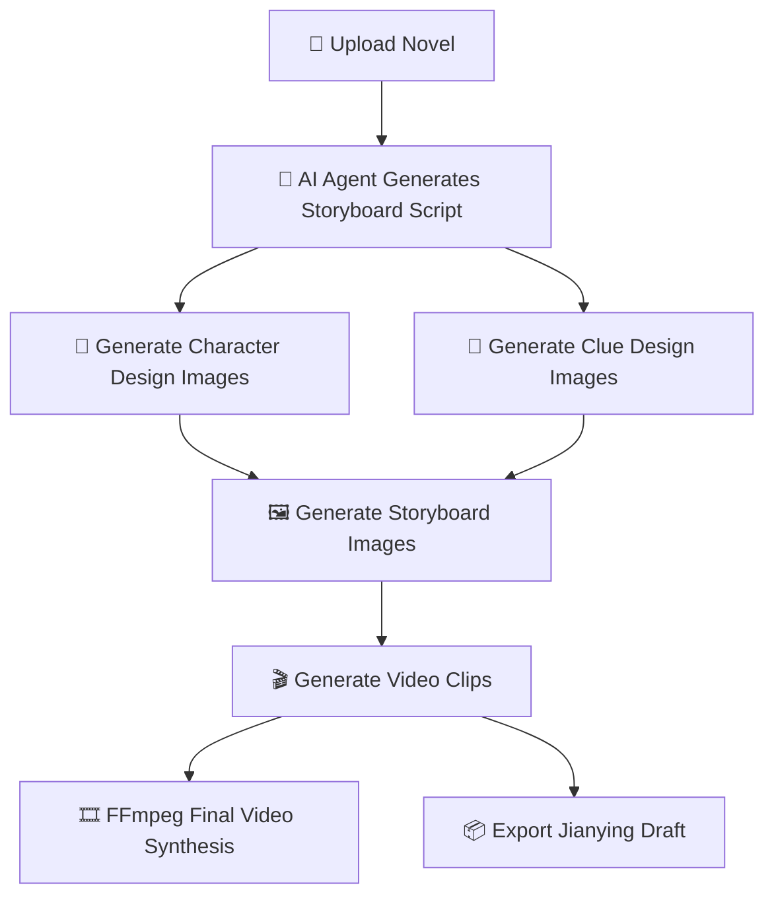
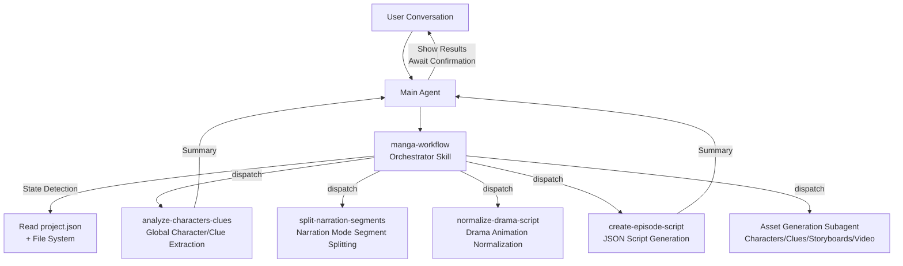
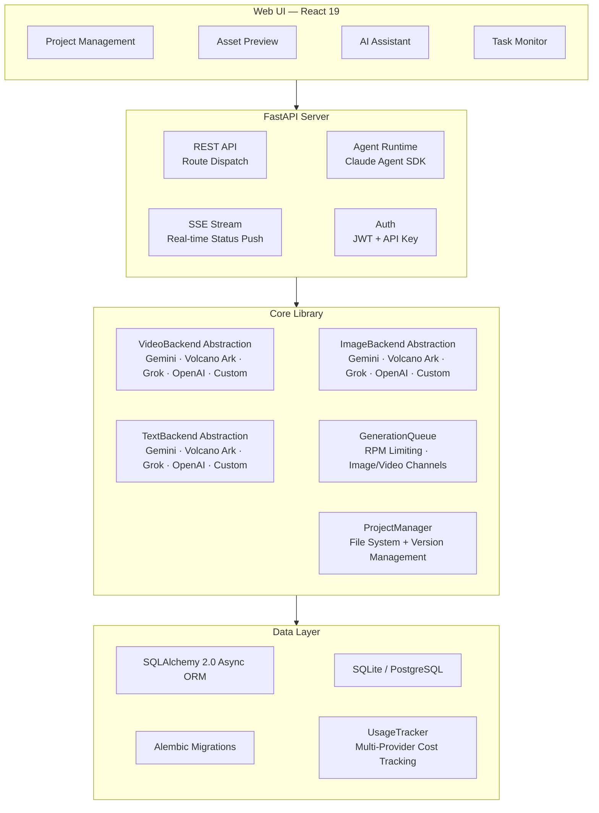

<p align="center">
  <a href="README.md"></a>
  <a href="README.en.md"></a>
  <a href="README.vi.md"></a>
</p>

<h1 align="center">
  <br>
  <picture>
    <source media="(prefers-color-scheme: light)" srcset="frontend/public/android-chrome-maskable-512x512.png">
    <source media="(prefers-color-scheme: dark)" srcset="frontend/public/android-chrome-512x512.png">
    
  </picture>
  <br>
  ArcReel
  <br>
</h1>

<h4 align="center">Open-Source AI Video Generation Workspace — Novel to Short Video, Powered by AI Agents</h4>

<p align="center">
  <a href="#quick-start"></a>
  <a href="https://github.com/ArcReel/ArcReel/blob/main/LICENSE"></a>
  <a href="https://github.com/ArcReel/ArcReel"></a>
  <a href="https://github.com/ArcReel/ArcReel/pkgs/container/arcreel"></a>
  <a href="https://github.com/ArcReel/ArcReel/actions/workflows/test.yml"></a>
</p>

<p align="center">
  
  
  
  
  
  
  
  
</p>

<p align="center">
  
</p>

---

## Core Capabilities

<table>
<tr>
<td width="20%" align="center">
<h3>🤖 AI Agent Workflow</h3>
Built on the <strong>Claude Agent SDK</strong>, orchestrating Skill + focused Subagent multi-agent collaboration to automatically complete the full pipeline from script creation to video synthesis
</td>
<td width="20%" align="center">
<h3>🎨 Multi-Provider Image Generation</h3>
<strong>Gemini</strong>, <strong>Volcano Ark (ByteDance)</strong>, <strong>Grok</strong>, <strong>OpenAI</strong> and custom providers. Character design images ensure character consistency; clue tracking maintains prop/scene coherence across shots
</td>
<td width="20%" align="center">
<h3>🎬 Multi-Provider Video Generation</h3>
<strong>Veo 3.1</strong>, <strong>Seedance</strong>, <strong>Grok</strong>, <strong>Sora 2</strong> and custom providers, switchable globally or per project
</td>
<td width="20%" align="center">
<h3>⚡ Async Task Queue</h3>
RPM rate limiting + independent Image/Video concurrency channels, lease-based scheduling, supports checkpoint resume
</td>
<td width="20%" align="center">
<h3>🖥️ Visual Workspace</h3>
Web UI for project management, asset preview, version rollback, real-time SSE task tracking, with built-in AI assistant
</td>
</tr>
</table>

## Workflow



## Quick Start

### Default Deployment (SQLite)

```bash
git clone https://github.com/ArcReel/ArcReel.git
cd ArcReel/deploy
cp .env.example .env
docker compose up -d
# Visit http://localhost:1241
```

### Production Deployment (PostgreSQL)

```bash
cd ArcReel/deploy/production
cp .env.example .env    # Set POSTGRES_PASSWORD
docker compose up -d
```

After first startup, log in with the default account (username `admin`, password set via `AUTH_PASSWORD` in `.env`; if not set, it is auto-generated on first launch and written back to `.env`), then go to the **Settings page** (`/settings`) to complete configuration:

1. **ArcReel Agent** — Configure Anthropic API Key (powers the AI assistant), supports custom Base URL and model
2. **AI Image/Video Generation** — Configure at least one provider's API Key (Gemini / Volcano Ark / Grok / OpenAI), or add a custom provider

> 📖 For detailed steps, see the [Full Getting Started Guide](docs/getting-started.md)

## Features

- **Complete Production Pipeline** — Novel → Script → Character Design → Storyboard Images → Video Clips → Final Video, one-click orchestration
- **Multi-Agent Architecture** — Orchestrator Skill detects project state and automatically dispatches focused Subagents; each Subagent completes one task then returns a summary
- **Multi-Provider Support** — Image/video/text generation supports four built-in providers: Gemini, Volcano Ark, Grok, OpenAI, switchable globally or per project
- **Custom Providers** — Connect any OpenAI-compatible / Google-compatible API (e.g., Ollama, vLLM, third-party proxies), auto-discovers available models and assigns media types, with feature parity to built-in providers
- **Two Content Modes** — Narration mode splits segments by reading rhythm; drama/animation mode organizes by scene/dialogue structure
- **Progressive Episode Planning** — Human-AI collaboration for splitting long novels: peek probe → Agent suggests breakpoints → user confirms → physical split, produce on demand
- **Style Reference Images** — Upload style images; AI automatically analyzes and applies them uniformly to all image generation, ensuring visual consistency across the project
- **Character Consistency** — AI first generates character design images; all subsequent storyboards and videos reference that design
- **Clue Tracking** — Key props and scene elements marked as "clues" maintain visual coherence across shots
- **Version History** — Each regeneration automatically saves a historical version, supporting one-click rollback
- **Multi-Provider Cost Tracking** — All image/video/text generation included in cost calculation, billed per provider strategy, with separate statistics by currency
- **Cost Estimation** — Estimate project/episode/shot costs before generation, with three-level drill-down showing estimated vs. actual cost comparison
- **Jianying Draft Export** — Export Jianying draft ZIPs by episode, supporting Jianying 5.x / 6+ ([Operation Guide](docs/jianying-export-guide.md))
- **Project Import/Export** — Package entire project as archive for easy backup and migration

## Provider Support

ArcReel supports multiple built-in providers and custom providers through unified `ImageBackend` / `VideoBackend` / `TextBackend` protocols, switchable globally or per project:

### Image Providers

| Provider | Available Models | Capabilities | Billing |
|----------|-----------------|--------------|---------|
| **Gemini** (Google) | Nano Banana 2, Nano Banana Pro | Text-to-image, image-to-image (multi-reference) | Resolution lookup table (USD) |
| **Volcano Ark** (ByteDance) | Seedream 5.0, Seedream 5.0 Lite, Seedream 4.5, Seedream 4.0 | Text-to-image, image-to-image | Per image (CNY) |
| **Grok** (xAI) | Grok Imagine Image, Grok Imagine Image Pro | Text-to-image, image-to-image | Per image (USD) |
| **OpenAI** | GPT Image 1.5, GPT Image 1 Mini | Text-to-image, image-to-image (multi-reference) | Per image (USD) |

### Video Providers

| Provider | Available Models | Capabilities | Billing |
|----------|-----------------|--------------|---------|
| **Gemini** (Google) | Veo 3.1, Veo 3.1 Fast, Veo 3.1 Lite | Text-to-video, image-to-video, video extension, negative prompts | Resolution × duration lookup table (USD) |
| **Volcano Ark** (ByteDance) | Seedance 2.0, Seedance 2.0 Fast, Seedance 1.5 Pro | Text-to-video, image-to-video, video extension, audio generation, seed control, offline inference | Per token usage (CNY) |
| **Grok** (xAI) | Grok Imagine Video | Text-to-video, image-to-video | Per second (USD) |
| **OpenAI** | Sora 2, Sora 2 Pro | Text-to-video, image-to-video | Per second (USD) |

### Text Providers

| Provider | Available Models | Capabilities | Billing |
|----------|-----------------|--------------|---------|
| **Gemini** (Google) | Gemini 3.1 Flash, Gemini 3.1 Flash Lite, Gemini 3 Pro | Text generation, structured output, visual understanding | Per token usage (USD) |
| **Volcano Ark** (ByteDance) | Doubao Seed series | Text generation, structured output, visual understanding | Per token usage (CNY) |
| **Grok** (xAI) | Grok 4.20, Grok 4.1 Fast series | Text generation, structured output, visual understanding | Per token usage (USD) |
| **OpenAI** | GPT-5.4, GPT-5.4 Mini, GPT-5.4 Nano | Text generation, structured output, visual understanding | Per token usage (USD) |

### Custom Providers

In addition to built-in providers, you can connect any **OpenAI-compatible** or **Google-compatible** API:

- Add a custom provider in the settings page with Base URL and API Key
- Automatically calls `/v1/models` to discover available models, inferring media type (image/video/text) from model names
- Feature parity with built-in providers: global/project-level switching, cost tracking, version management

Provider selection priority: project-level settings > global default. When switching providers, common settings (resolution, aspect ratio, audio, etc.) carry over directly; provider-specific parameters are preserved.

## Community

Scan the QR code to join the Feishu (Lark) community group for help and latest updates:

<p align="center">
  
</p>

## AI Assistant Architecture

ArcReel's AI assistant is built on the Claude Agent SDK, using an **Orchestrator Skill + Focused Subagent** multi-agent architecture:



**Core Design Principles**:

- **Orchestrator Skill (manga-workflow)** — Has state detection capability, automatically determines the current project phase (character design / episode planning / preprocessing / script generation / asset generation), dispatches the corresponding Subagent, supports entry from any phase and interruption/resume
- **Focused Subagent** — Each Subagent completes only one task then returns; large context such as the novel source text stays inside the Subagent, while the main Agent only receives a refined summary, protecting context space
- **Skill vs. Subagent Boundary** — Skills handle deterministic script execution (API calls, file generation); Subagents handle tasks requiring reasoning and analysis (character extraction, script normalization)
- **Inter-Phase Confirmation** — After each Subagent returns, the main Agent presents a results summary to the user and waits for confirmation before proceeding to the next phase

## OpenClaw Integration

ArcReel supports calls from external AI Agent platforms such as [OpenClaw](https://openclaw.ai), enabling natural language-driven video creation:

1. Generate an API Key (with `arc-` prefix) in ArcReel's settings page
2. Load ArcReel's Skill definition in OpenClaw (visit `http://your-domain/skill.md` for automatic retrieval)
3. Create projects, generate scripts, and produce videos through OpenClaw conversation

Technical implementation: API Key authentication (Bearer Token) + synchronous Agent conversation endpoint (`POST /api/v1/agent/chat`), internally connecting to the SSE streaming assistant and collecting complete responses.

## Technical Architecture



## Tech Stack

| Layer | Technology |
|-------|------------|
| **Frontend** | React 19, TypeScript, Tailwind CSS 4, wouter, zustand, Framer Motion, Vite |
| **Backend** | FastAPI, Python 3.12+, uvicorn, Pydantic 2 |
| **AI Agents** | Claude Agent SDK (Skill + Subagent multi-agent architecture) |
| **Image Generation** | Gemini (`google-genai`), Volcano Ark (`volcengine-python-sdk[ark]`), Grok (`xai-sdk`), OpenAI (`openai`) |
| **Video Generation** | Gemini Veo 3.1 (`google-genai`), Volcano Ark Seedance 2.0/1.5 (`volcengine-python-sdk[ark]`), Grok (`xai-sdk`), OpenAI Sora 2 (`openai`) |
| **Text Generation** | Gemini (`google-genai`), Volcano Ark (`volcengine-python-sdk[ark]`), Grok (`xai-sdk`), OpenAI (`openai`), Instructor (structured output fallback) |
| **Media Processing** | FFmpeg, Pillow |
| **ORM & Database** | SQLAlchemy 2.0 (async), Alembic, aiosqlite, asyncpg — SQLite (default) / PostgreSQL (production) |
| **Authentication** | JWT (`pyjwt`), API Key (SHA-256 hash), Argon2 password hashing (`pwdlib`) |
| **Deployment** | Docker, Docker Compose (`deploy/` default, `deploy/production/` with PostgreSQL) |

## Documentation

- 📖 [Full Getting Started Guide](docs/getting-started.md) — Step-by-step guide from scratch
- 📦 [Jianying Draft Export Guide](docs/jianying-export-guide.md) — Import video clips into Jianying desktop for secondary editing
- 💰 [Google GenAI Cost Reference](docs/google-genai-docs/Google视频&图片生成费用参考.md) — Gemini image / Veo video generation cost reference
- 💰 [Volcano Ark Cost Reference](docs/ark-docs/火山方舟费用参考.md) — Volcano Ark video / image / text model cost reference

## Contributing

Contributions, bug reports, and feature suggestions are welcome! Please see the [Contributing Guide](CONTRIBUTING.md) for local development setup, testing, and code standards.

## License

[AGPL-3.0](LICENSE)

---

<p align="center">
  If you find this project useful, please give it a ⭐ Star!
</p>
