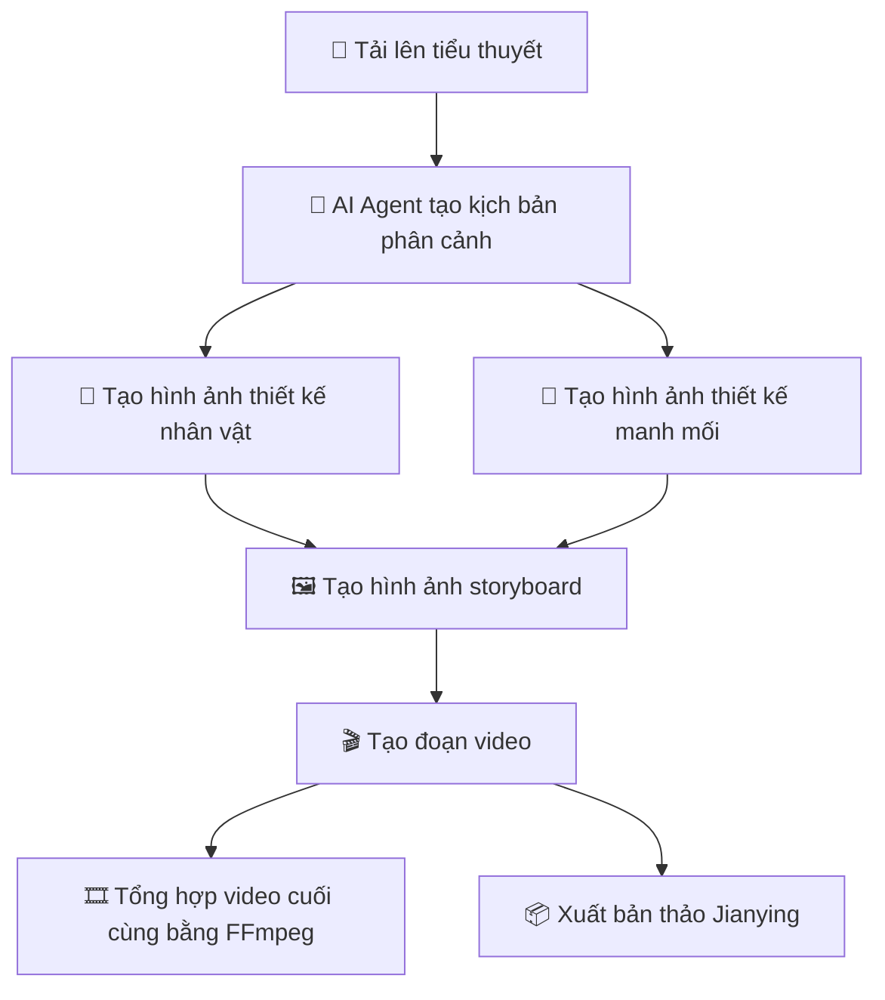
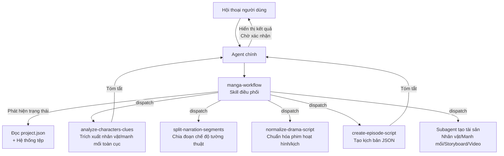
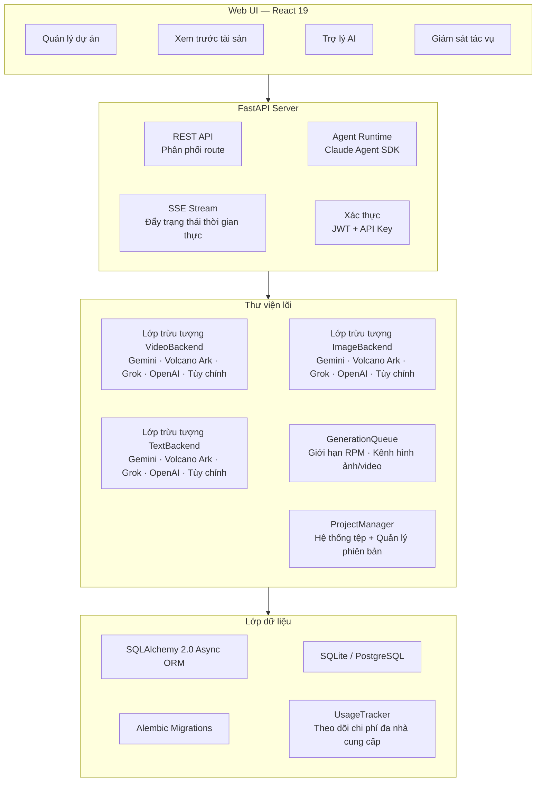

<p align="center">
  <a href="README.md"></a>
  <a href="README.en.md"></a>
  <a href="README.vi.md"></a>
</p>

<h1 align="center">
  <br>
  <picture>
    <source media="(prefers-color-scheme: light)" srcset="frontend/public/android-chrome-maskable-512x512.png">
    <source media="(prefers-color-scheme: dark)" srcset="frontend/public/android-chrome-512x512.png">
    
  </picture>
  <br>
  ArcReel
  <br>
</h1>

<h4 align="center">Không gian làm việc tạo video AI mã nguồn mở — Từ tiểu thuyết đến video ngắn, được điều khiển bởi AI Agent</h4>

<p align="center">
  <a href="#bắt-đầu-nhanh"></a>
  <a href="https://github.com/ArcReel/ArcReel/blob/main/LICENSE"></a>
  <a href="https://github.com/ArcReel/ArcReel"></a>
  <a href="https://github.com/ArcReel/ArcReel/pkgs/container/arcreel"></a>
  <a href="https://github.com/ArcReel/ArcReel/actions/workflows/test.yml"></a>
</p>

<p align="center">
  
  
  
  
  
  
  
  
</p>

<p align="center">
  
</p>

---

## Khả năng cốt lõi

<table>
<tr>
<td width="20%" align="center">
<h3>🤖 Quy trình AI Agent</h3>
Được xây dựng trên <strong>Claude Agent SDK</strong>, điều phối Skill + Subagent tập trung theo kiến trúc đa tác nhân, tự động hoàn thành toàn bộ quy trình từ viết kịch bản đến tổng hợp video
</td>
<td width="20%" align="center">
<h3>🎨 Tạo hình ảnh đa nhà cung cấp</h3>
<strong>Gemini</strong>, <strong>Volcano Ark (ByteDance)</strong>, <strong>Grok</strong>, <strong>OpenAI</strong> và nhà cung cấp tùy chỉnh. Hình ảnh thiết kế nhân vật đảm bảo tính nhất quán; theo dõi manh mối duy trì sự gắn kết của đạo cụ/cảnh quay
</td>
<td width="20%" align="center">
<h3>🎬 Tạo video đa nhà cung cấp</h3>
<strong>Veo 3.1</strong>, <strong>Seedance</strong>, <strong>Grok</strong>, <strong>Sora 2</strong> và nhà cung cấp tùy chỉnh, có thể chuyển đổi toàn cục hoặc theo dự án
</td>
<td width="20%" align="center">
<h3>⚡ Hàng đợi tác vụ bất đồng bộ</h3>
Giới hạn tốc độ RPM + kênh đồng thời độc lập cho hình ảnh/video, lên lịch dựa trên lease, hỗ trợ tiếp tục từ điểm dừng
</td>
<td width="20%" align="center">
<h3>🖥️ Không gian làm việc trực quan</h3>
Web UI quản lý dự án, xem trước tài sản, khôi phục phiên bản, theo dõi tác vụ SSE thời gian thực, tích hợp trợ lý AI
</td>
</tr>
</table>

## Quy trình làm việc



## Bắt Đầu Nhanh

### Triển khai mặc định (SQLite)

```bash
git clone https://github.com/ArcReel/ArcReel.git
cd ArcReel/deploy
cp .env.example .env
docker compose up -d
# Truy cập http://localhost:1241
```

### Triển khai sản xuất (PostgreSQL)

```bash
cd ArcReel/deploy/production
cp .env.example .env    # Cần đặt POSTGRES_PASSWORD
docker compose up -d
```

Sau lần khởi động đầu tiên, đăng nhập bằng tài khoản mặc định (tên người dùng `admin`, mật khẩu được đặt qua `AUTH_PASSWORD` trong `.env`; nếu không đặt, sẽ được tự động tạo khi khởi động lần đầu và ghi lại vào `.env`), sau đó vào **trang Cài đặt** (`/settings`) để hoàn tất cấu hình:

1. **ArcReel Agent** — Cấu hình Anthropic API Key (điều khiển trợ lý AI), hỗ trợ Base URL và mô hình tùy chỉnh
2. **Tạo hình ảnh/video AI** — Cấu hình API Key của ít nhất một nhà cung cấp (Gemini / Volcano Ark / Grok / OpenAI), hoặc thêm nhà cung cấp tùy chỉnh

> 📖 Để biết các bước chi tiết, xem [Hướng dẫn bắt đầu đầy đủ](docs/getting-started.md)

## Tính năng

- **Quy trình sản xuất hoàn chỉnh** — Tiểu thuyết → Kịch bản → Thiết kế nhân vật → Hình ảnh storyboard → Đoạn video → Video hoàn chỉnh, điều phối một chạm
- **Kiến trúc đa tác nhân** — Skill điều phối phát hiện trạng thái dự án và tự động điều phối các Subagent tập trung; mỗi Subagent hoàn thành một nhiệm vụ rồi trả về tóm tắt
- **Hỗ trợ đa nhà cung cấp** — Tạo hình ảnh/video/văn bản hỗ trợ bốn nhà cung cấp tích hợp sẵn: Gemini, Volcano Ark, Grok, OpenAI, có thể chuyển đổi toàn cục hoặc theo dự án
- **Nhà cung cấp tùy chỉnh** — Kết nối bất kỳ API tương thích OpenAI / Google nào (ví dụ: Ollama, vLLM, proxy bên thứ ba), tự động phát hiện các mô hình có sẵn và phân công loại phương tiện, với tính năng tương đương nhà cung cấp tích hợp sẵn
- **Hai chế độ nội dung** — Chế độ tường thuật chia đoạn theo nhịp đọc; chế độ phim hoạt hình/kịch tổ chức theo cấu trúc cảnh/hội thoại
- **Lập kế hoạch tập phim dần dần** — Hợp tác người-AI để chia nhỏ tiểu thuyết dài: thăm dò peek → Agent đề xuất điểm ngắt → người dùng xác nhận → chia vật lý, sản xuất theo nhu cầu
- **Hình ảnh tham chiếu phong cách** — Tải lên hình ảnh phong cách; AI tự động phân tích và áp dụng đồng đều cho tất cả việc tạo hình ảnh, đảm bảo tính nhất quán hình ảnh trong toàn dự án
- **Nhất quán nhân vật** — AI trước tiên tạo hình ảnh thiết kế nhân vật; tất cả storyboard và video tiếp theo đều tham chiếu thiết kế đó
- **Theo dõi manh mối** — Các đạo cụ quan trọng và yếu tố cảnh được đánh dấu là "manh mối" để duy trì sự gắn kết hình ảnh qua các cảnh quay
- **Lịch sử phiên bản** — Mỗi lần tạo lại tự động lưu phiên bản lịch sử, hỗ trợ khôi phục một chạm
- **Theo dõi chi phí đa nhà cung cấp** — Tất cả tạo hình ảnh/video/văn bản được tính vào chi phí, tính phí theo chiến lược của từng nhà cung cấp, thống kê riêng theo đơn vị tiền tệ
- **Ước tính chi phí** — Ước tính chi phí dự án/tập/cảnh trước khi tạo, với ba mức phân tích hiển thị so sánh chi phí ước tính và thực tế
- **Xuất bản thảo Jianying** — Xuất ZIP bản thảo Jianying theo tập, hỗ trợ Jianying 5.x / 6+ ([Hướng dẫn thao tác](docs/jianying-export-guide.md))
- **Nhập/Xuất dự án** — Đóng gói toàn bộ dự án thành tệp lưu trữ để dễ dàng sao lưu và di chuyển

## Hỗ trợ nhà cung cấp

ArcReel hỗ trợ nhiều nhà cung cấp tích hợp sẵn và nhà cung cấp tùy chỉnh thông qua các giao thức `ImageBackend` / `VideoBackend` / `TextBackend` thống nhất, có thể chuyển đổi toàn cục hoặc theo dự án:

### Nhà cung cấp hình ảnh

| Nhà cung cấp | Mô hình có sẵn | Khả năng | Tính phí |
|--------------|----------------|----------|----------|
| **Gemini** (Google) | Nano Banana 2, Nano Banana Pro | Văn bản thành hình ảnh, hình ảnh thành hình ảnh (đa tham chiếu) | Bảng tra cứu theo độ phân giải (USD) |
| **Volcano Ark** (ByteDance) | Seedream 5.0, Seedream 5.0 Lite, Seedream 4.5, Seedream 4.0 | Văn bản thành hình ảnh, hình ảnh thành hình ảnh | Theo hình ảnh (CNY) |
| **Grok** (xAI) | Grok Imagine Image, Grok Imagine Image Pro | Văn bản thành hình ảnh, hình ảnh thành hình ảnh | Theo hình ảnh (USD) |
| **OpenAI** | GPT Image 1.5, GPT Image 1 Mini | Văn bản thành hình ảnh, hình ảnh thành hình ảnh (đa tham chiếu) | Theo hình ảnh (USD) |

### Nhà cung cấp video

| Nhà cung cấp | Mô hình có sẵn | Khả năng | Tính phí |
|--------------|----------------|----------|----------|
| **Gemini** (Google) | Veo 3.1, Veo 3.1 Fast, Veo 3.1 Lite | Văn bản thành video, hình ảnh thành video, mở rộng video, gợi ý âm tính | Bảng tra cứu độ phân giải × thời lượng (USD) |
| **Volcano Ark** (ByteDance) | Seedance 2.0, Seedance 2.0 Fast, Seedance 1.5 Pro | Văn bản thành video, hình ảnh thành video, mở rộng video, tạo âm thanh, kiểm soát seed, suy luận ngoại tuyến | Theo lượng token (CNY) |
| **Grok** (xAI) | Grok Imagine Video | Văn bản thành video, hình ảnh thành video | Theo giây (USD) |
| **OpenAI** | Sora 2, Sora 2 Pro | Văn bản thành video, hình ảnh thành video | Theo giây (USD) |

### Nhà cung cấp văn bản

| Nhà cung cấp | Mô hình có sẵn | Khả năng | Tính phí |
|--------------|----------------|----------|----------|
| **Gemini** (Google) | Gemini 3.1 Flash, Gemini 3.1 Flash Lite, Gemini 3 Pro | Tạo văn bản, đầu ra có cấu trúc, hiểu hình ảnh | Theo lượng token (USD) |
| **Volcano Ark** (ByteDance) | Dòng Doubao Seed | Tạo văn bản, đầu ra có cấu trúc, hiểu hình ảnh | Theo lượng token (CNY) |
| **Grok** (xAI) | Grok 4.20, dòng Grok 4.1 Fast | Tạo văn bản, đầu ra có cấu trúc, hiểu hình ảnh | Theo lượng token (USD) |
| **OpenAI** | GPT-5.4, GPT-5.4 Mini, GPT-5.4 Nano | Tạo văn bản, đầu ra có cấu trúc, hiểu hình ảnh | Theo lượng token (USD) |

### Nhà cung cấp tùy chỉnh

Ngoài các nhà cung cấp tích hợp sẵn, bạn có thể kết nối bất kỳ API **tương thích OpenAI** hoặc **tương thích Google** nào:

- Thêm nhà cung cấp tùy chỉnh trong trang cài đặt với Base URL và API Key
- Tự động gọi `/v1/models` để phát hiện các mô hình có sẵn, suy luận loại phương tiện (hình ảnh/video/văn bản) từ tên mô hình
- Tính năng tương đương nhà cung cấp tích hợp sẵn: chuyển đổi toàn cục/theo dự án, theo dõi chi phí, quản lý phiên bản

Ưu tiên chọn nhà cung cấp: cài đặt cấp dự án > mặc định toàn cục. Khi chuyển đổi nhà cung cấp, các cài đặt chung (độ phân giải, tỷ lệ khung hình, âm thanh, v.v.) được giữ nguyên; các thông số riêng của nhà cung cấp được bảo toàn.

## Cộng đồng

Quét mã QR để tham gia nhóm cộng đồng Feishu (Lark) để được hỗ trợ và cập nhật mới nhất:

<p align="center">
  
</p>

## Kiến trúc trợ lý AI

Trợ lý AI của ArcReel được xây dựng trên Claude Agent SDK, sử dụng kiến trúc đa tác nhân **Skill điều phối + Subagent tập trung**:



**Nguyên tắc thiết kế cốt lõi**:

- **Skill điều phối (manga-workflow)** — Có khả năng phát hiện trạng thái, tự động xác định giai đoạn dự án hiện tại (thiết kế nhân vật / lập kế hoạch tập / tiền xử lý / tạo kịch bản / tạo tài sản), điều phối Subagent tương ứng, hỗ trợ nhập từ bất kỳ giai đoạn nào và tiếp tục sau khi gián đoạn
- **Subagent tập trung** — Mỗi Subagent chỉ hoàn thành một nhiệm vụ rồi trả về; ngữ cảnh lớn như văn bản gốc tiểu thuyết ở lại trong Subagent, trong khi Agent chính chỉ nhận tóm tắt đã được tinh lọc, bảo vệ không gian ngữ cảnh
- **Ranh giới Skill vs Subagent** — Skill xử lý thực thi script xác định (gọi API, tạo tệp); Subagent xử lý các tác vụ đòi hỏi lý luận và phân tích (trích xuất nhân vật, chuẩn hóa kịch bản)
- **Xác nhận giữa các giai đoạn** — Sau khi mỗi Subagent trả về, Agent chính trình bày tóm tắt kết quả cho người dùng và chờ xác nhận trước khi tiến sang giai đoạn tiếp theo

## Tích hợp OpenClaw

ArcReel hỗ trợ các lệnh gọi từ các nền tảng AI Agent bên ngoài như [OpenClaw](https://openclaw.ai), cho phép tạo video bằng ngôn ngữ tự nhiên:

1. Tạo API Key (với tiền tố `arc-`) trong trang cài đặt của ArcReel
2. Tải định nghĩa Skill của ArcReel vào OpenClaw (truy cập `http://your-domain/skill.md` để lấy tự động)
3. Tạo dự án, tạo kịch bản và sản xuất video thông qua hội thoại OpenClaw

Triển khai kỹ thuật: Xác thực API Key (Bearer Token) + điểm cuối hội thoại Agent đồng bộ (`POST /api/v1/agent/chat`), kết nối nội bộ với trợ lý phát trực tuyến SSE và thu thập phản hồi hoàn chỉnh.

## Kiến trúc kỹ thuật



## Ngăn xếp công nghệ

| Tầng | Công nghệ |
|------|-----------|
| **Giao diện người dùng** | React 19, TypeScript, Tailwind CSS 4, wouter, zustand, Framer Motion, Vite |
| **Backend** | FastAPI, Python 3.12+, uvicorn, Pydantic 2 |
| **AI Agent** | Claude Agent SDK (kiến trúc đa tác nhân Skill + Subagent) |
| **Tạo hình ảnh** | Gemini (`google-genai`), Volcano Ark (`volcengine-python-sdk[ark]`), Grok (`xai-sdk`), OpenAI (`openai`) |
| **Tạo video** | Gemini Veo 3.1 (`google-genai`), Volcano Ark Seedance 2.0/1.5 (`volcengine-python-sdk[ark]`), Grok (`xai-sdk`), OpenAI Sora 2 (`openai`) |
| **Tạo văn bản** | Gemini (`google-genai`), Volcano Ark (`volcengine-python-sdk[ark]`), Grok (`xai-sdk`), OpenAI (`openai`), Instructor (dự phòng đầu ra có cấu trúc) |
| **Xử lý phương tiện** | FFmpeg, Pillow |
| **ORM & Cơ sở dữ liệu** | SQLAlchemy 2.0 (async), Alembic, aiosqlite, asyncpg — SQLite (mặc định) / PostgreSQL (sản xuất) |
| **Xác thực** | JWT (`pyjwt`), API Key (băm SHA-256), Băm mật khẩu Argon2 (`pwdlib`) |
| **Triển khai** | Docker, Docker Compose (`deploy/` mặc định, `deploy/production/` với PostgreSQL) |

## Tài liệu

- 📖 [Hướng dẫn bắt đầu đầy đủ](docs/getting-started.md) — Hướng dẫn từng bước từ đầu
- 📦 [Hướng dẫn xuất bản thảo Jianying](docs/jianying-export-guide.md) — Nhập các đoạn video vào Jianying desktop để chỉnh sửa thêm
- 💰 [Tài liệu tham khảo chi phí Google GenAI](docs/google-genai-docs/Google视频&图片生成费用参考.md) — Tài liệu tham khảo chi phí tạo hình ảnh Gemini / video Veo
- 💰 [Tài liệu tham khảo chi phí Volcano Ark](docs/ark-docs/火山方舟费用参考.md) — Tài liệu tham khảo chi phí mô hình video / hình ảnh / văn bản Volcano Ark

## Đóng góp

Chào mừng các đóng góp, báo cáo lỗi và đề xuất tính năng! Vui lòng xem [Hướng dẫn đóng góp](CONTRIBUTING.md) để biết cách thiết lập môi trường phát triển cục bộ, kiểm thử và tiêu chuẩn code.

## Giấy phép

[AGPL-3.0](LICENSE)

---

<p align="center">
  Nếu bạn thấy dự án hữu ích, hãy tặng một ⭐ Star để ủng hộ!
</p>
